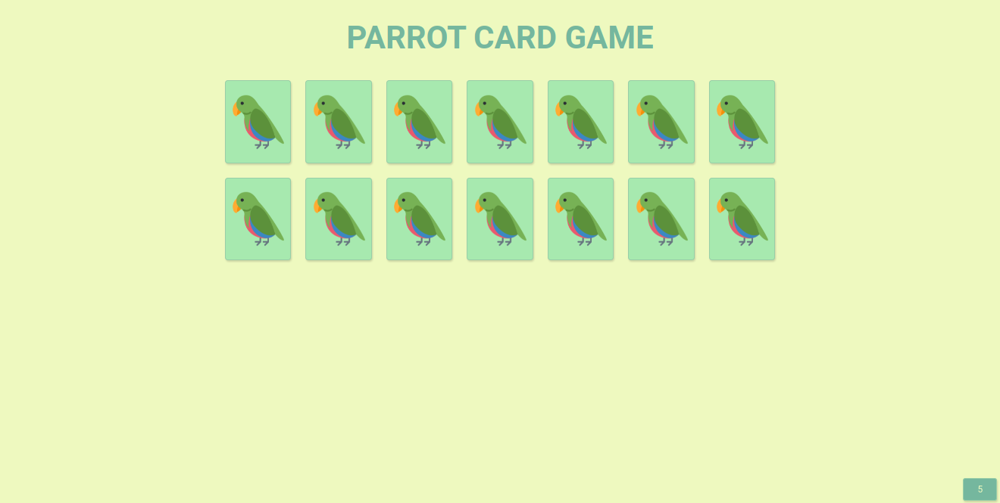
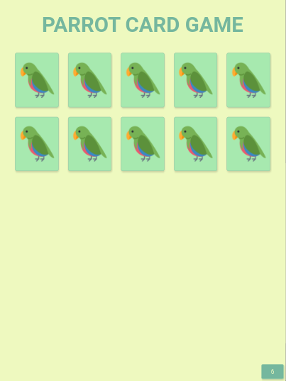
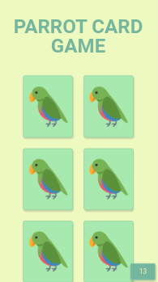

# 
Parrots

### 
Jogo da Memória

   
   
    
   

### :clipboard: Descrição

Parrots é um jogo da memória temático com aleatoridade, efeitos e transição, responsividade e papagaios dançantes!

#### 🦜 [Acesse aqui](https://gabrielatiago.github.io/Parrots/)

---

### :computer: Telas

    <h5>Desktop:</h5>
    
    <h5>Tablet:</h5>
    
    <h5>Mobile:</h5>
    

$~$

---

### 🎮 Playing

    

$~$

---

### :books: Lições Aprendidas

- Variáveis de controle
- Manipulação do DOM
- Eventos de click
- Animações de CSS
- Adicionar CSS via JS
- Separação de responsabilidades
- Código limpo

---

### :bulb: Reconhecimentos

- [Badges para Github](https://github.com/alexandresanlim/Badges4-README.md-Profile#-database-)
- [README Inspiração de README](https://gist.github.com/luanalessa/7f98467a5ed62d00dcbde67d4556a1e4#file-readme-md)
- [Diven Education](https://www.driven.com.br)

---

### 👩‍🦱 Autora

- Gabriela Tiago é uma aluna de desenvolvimento web de Fullstack na Driven Education. Percorrendo o caminho do conhecimento, buscando aprimorar suas habilidades técnicas e de softskills, para que ela possa melhorar o trabalho que desenvolve.

 [🔝 De volta ao topo](#parrots) 